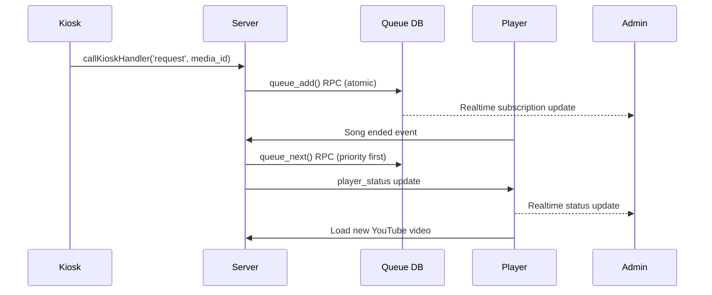

# 🎵 Queue Management Implementation Guide

## 📋 Table of Contents

1. [Overview](#overview)
2. [Architecture](#architecture)
3. [Core Components](#core-components)
4. [Data Flow](#data-flow)
5. [Critical Implementation Details](#critical-implementation-details)
6. [Files & Functions](#files--functions)
7. [The Fix](#the-fix)
8. [What NOT to Change](#what-not-to-change)
9. [Testing & Verification](#testing--verification)

---

## Overview

The queue management system is the heart of Obie Jukebox v2, handling song requests, playback order, and real-time synchronization across all clients. It implements a **server-first architecture** where all business logic lives in PostgreSQL RPCs and Supabase Edge Functions.

### Key Principles

- **Server-First**: All state and logic in database, not client
- **Real-time Sync**: Instant updates via Supabase Realtime subscriptions  
- **Priority Queue**: Paid requests play before normal queue
- **Atomic Operations**: PostgreSQL locks prevent race conditions
- **Position-Based**: Queue ordered by `position` field (1,2,3...)

---

## Architecture

```
┌─────────────────────────────────────────────────────────┐
│                   POSTGRESQL DATABASE                │
│              (Single Source of Truth)               │
│                                                      │
│  ┌──────────────┐  ┌──────────────┐  ┌──────────────┐     │
│  │   QUEUE      │  │ PLAYER_STATUS│  │   RPCs      │     │
│  │   TABLE      │  │   TABLE     │  │ (Functions)  │     │
│  └──────────────┘  └──────────────┘  └──────────────┘     │
│         │                  │                  │                 │
│         ▼                  ▼                  ▼                 │
│  ┌─────────────┐    ┌─────────────┐    ┌─────────────┐     │
│  │   ADMIN     │    │   PLAYER    │    │   KIOSK     │     │
│  │  CONSOLE    │    │   WINDOW    │    │  INTERFACE  │     │
│  │             │    │             │    │             │     │
│  • Queue UI  │    │ • YouTube   │    │ • Search    │     │
│  • Controls  │    │   iframe    │    │ • Requests  │     │
│  • Status    │    │ • Heartbeat │    │ • Credits   │     │
│  └─────────────┘    └─────────────┘    └─────────────┘     │
└─────────────────────────────────────────────────────────┘
```

---

## Core Components

### 1. Queue Table Structure

```sql
CREATE TABLE queue (
  id UUID PRIMARY KEY DEFAULT gen_random_uuid(),
  player_id UUID NOT NULL REFERENCES players(id),
  media_item_id UUID NOT NULL REFERENCES media_items(id),
  type TEXT NOT NULL CHECK (type IN ('priority', 'normal')),
  position INT NOT NULL,
  requested_by TEXT,
  played_at TIMESTAMPTZ,  -- NULL = not played yet
  created_at TIMESTAMPTZ DEFAULT NOW(),
  
  UNIQUE(player_id, type, position)  -- Critical for ordering
);
```

### 2. Player Status Tracking

```sql
CREATE TABLE player_status (
  player_id UUID PRIMARY KEY REFERENCES players(id),
  current_media_id UUID REFERENCES media_items(id),
  state TEXT NOT NULL,  -- 'idle', 'playing', 'paused', 'loading'
  progress REAL DEFAULT 0,  -- 0.0 to 1.0
  now_playing_index INT DEFAULT -1,  -- Position in normal queue
  queue_head_position INT DEFAULT 0,  -- For UI display
  last_updated TIMESTAMPTZ DEFAULT NOW()
);
```

### 3. Priority System

- **Priority Queue**: `type = 'priority'` (paid kiosk requests)
- **Normal Queue**: `type = 'normal'` (regular playlist songs)
- **Playback Order**: Priority items always play first, regardless of position
- **Position Reset**: Priority items don't affect normal queue positions

---

## Data Flow

### Song Request Flow



### Queue Progression Logic

1. **Check Priority First**: Any `type='priority'` items with `played_at IS NULL`?
2. **Shuffle Check**: If no priority, check `player_settings.shuffle`
3. **Select Next Item**:
   - Priority: `ORDER BY position ASC LIMIT 1`
   - Normal + Shuffle: `ORDER BY RANDOM() LIMIT 1`  
   - Normal + No Shuffle: `ORDER BY position ASC LIMIT 1`
4. **Mark Played**: Set `played_at = NOW()` for selected item
5. **Update Status**: Set `current_media_id` and `state = 'loading'`

---

## Critical Implementation Details

### 🚨 **CRITICAL: 800ms Debounce**

**Location**: `web/shared/supabase-client.ts` - `subscribeToQueue()`

```typescript
// ✅ WORKING (Current Implementation)
() => {
  // Debounce refetch to allow database updates to complete
  console.log('[subscribeToQueue] Change detected, scheduling refetch in 800ms...');
  if (refetchTimeout) clearTimeout(refetchTimeout);
  refetchTimeout = setTimeout(() => {
    fetchQueue();
  }, 800); // ⚠️ CRITICAL: Prevents race conditions
}

// ❌ BROKEN (What broke it)
() => {
  // Immediately refetch on queue changes to keep display in sync with playback
  console.log('[subscribeToQueue] Change detected, refetching immediately...');
  fetchQueue(); // 🚨 RACE CONDITION!
}
```

**Why 800ms is Critical**:
- `queue_next` RPC updates both `queue` and `player_status` tables
- These are separate PostgreSQL transactions
- Realtime subscription fires when `queue` table changes
- Without debounce: UI fetches before `player_status` updates
- Result: `currentQueueItem` becomes `undefined`

### 🎯 **Current Queue Item Logic**

**Location**: `web/admin/src/App.tsx`

```typescript
// ✅ WORKING (Current Implementation)
const currentQueueItem = queue.find((item) => 
  item.media_item_id === status?.current_media_id
);

// ❌ BROKEN (What broke it)
const currentQueueItem = status?.current_queue_position !== undefined && 
  status?.current_queue_position >= 0
    ? queue.find((item) => item.position === status.current_queue_position)
    : queue.find((item) => item.media_item_id === status?.current_media_id);
```

**Why Media ID Search Works**:
- Direct lookup by `media_item_id` is reliable
- Position-based lookup fails when timing is off
- No dependency on additional database fields

---

## Files & Functions

### 📁 **Database Layer**

| File | Purpose | Critical Elements |
|-------|---------|------------------|
| `supabase/migrations/0001_initial_schema.sql` | Complete schema + RPCs | All table definitions, queue_next logic |
| `queue_next()` RPC | Core queue progression | Priority handling, shuffle logic, atomic locks |
| `queue_add()` RPC | Add items to queue | Position allocation, size limits, eviction |
| `queue_reorder()` RPC | Reorder queue items | Position renumbering, atomic updates |
| `queue_clear()` RPC | Clear queue | Type-specific clearing, status reset |

### 📁 **Backend Layer**

| File | Purpose | Critical Elements |
|-------|---------|------------------|
| `supabase/functions/queue-manager/index.ts` | Queue API endpoints | Calls all queue RPCs, handles errors |
| `supabase/functions/player-control/index.ts` | Player status updates | Handles heartbeat, song endings, calls queue_next |
| `supabase/functions/kiosk-handler/index.ts` | Kiosk operations | Search, credits, song requests |

### 📁 **Frontend Layer**

| File | Purpose | Critical Elements |
|-------|---------|------------------|
| `web/shared/supabase-client.ts` | API client + types | **800ms debounce**, Realtime subscriptions, PlayerStatus interface |
| `web/admin/src/App.tsx` | Admin console UI | **currentQueueItem logic**, queue display, controls |
| `web/player/src/App.tsx` | Media player | YouTube iframe, status reporting, heartbeat |
| `web/kiosk/src/App.tsx` | Public interface | Search UI, credit display, song requests |

---

## The Fix

### 🎯 **Root Cause Identified**

**Breaking Commit**: Feb 21, 2026 - `55a2e52d7074c14160c5f8e16621c903802d60a1`
**Title**: "Remove debounce in subscribeToQueue for immediate UI updates"

### 🔧 **What Was Fixed**

1. **Restored 800ms Debounce**
   ```typescript
   // Before (Broken): fetchQueue();
   // After (Fixed): setTimeout(() => { fetchQueue(); }, 800);
   ```

2. **Reverted currentQueueItem Logic**
   ```typescript
   // Before (Broken): Used current_queue_position field
   // After (Fixed): item.media_item_id === status?.current_media_id
   ```

3. **Reverted Database Functions**
   - `queue_next()`: Back to original return format `(media_item_id, title, url, duration)`
   - `player_status`: Removed `current_queue_position` column
   - `queue_reorder_wrapper()`: Removed position tracking resets

4. **Reverted Edge Functions**
   - `player-control`: Back to `next_item?.[0]` handling

### 🎉 **Result**

- ✅ **Race Conditions Eliminated**: 800ms debounce ensures database consistency
- ✅ **currentQueueItem Stable**: No more `undefined` issues
- ✅ **Queue Progression Reliable**: Admin console shows correct "now playing"
- ✅ **All Operations Working**: Add, remove, reorder, shuffle, skip, clear

---

## What NOT to Change

### 🚨 **CRITICAL ELEMENTS THAT MUST NOT BE MODIFIED**

#### 1. **800ms Debounce in subscribeToQueue**
```typescript
// ❌ NEVER CHANGE THIS
refetchTimeout = setTimeout(() => {
  fetchQueue();
}, 800); // ⚠️ CRITICAL: Prevents race conditions
```

**Why**: Without this debounce, race conditions between database updates and UI refresh will break `currentQueueItem`.

#### 2. **currentQueueItem Media ID Lookup**
```typescript
// ❌ NEVER CHANGE THIS
const currentQueueItem = queue.find((item) => 
  item.media_item_id === status?.current_media_id
);
```

**Why**: Direct media ID lookup is reliable and doesn't depend on timing-sensitive position fields.

#### 3. **queue_next Priority Logic**
```sql
-- ❌ NEVER CHANGE THIS ORDER
IF EXISTS (SELECT 1 FROM queue WHERE player_id = p_player_id AND type = 'priority' AND played_at IS NULL) THEN
  -- Priority items first
ELSIF v_shuffle AND EXISTS (SELECT 1 FROM queue WHERE player_id = p_player_id AND type = 'normal' AND played_at IS NULL) THEN
  -- Shuffle normal items
ELSE
  -- Sequential normal items
END IF;
```

**Why**: Priority queue must always play first, regardless of shuffle setting.

#### 4. **PostgreSQL Advisory Locks**
```sql
-- ❌ NEVER REMOVE THIS
PERFORM pg_advisory_xact_lock(hashtext('queue_' || p_player_id::text));
```

**Why**: Prevents concurrent queue operations from corrupting data.

#### 5. **Queue Position Uniqueness**
```sql
-- ❌ NEVER CHANGE THIS
UNIQUE(player_id, type, position)
```

**Why**: Ensures no duplicate positions within each queue type.

#### 6. **Realtime Subscription Pattern**
```typescript
// ❌ NEVER CHANGE TO IMMEDIATE FETCH
() => {
  // Debounce refetch to allow database updates to complete
  setTimeout(() => { fetchQueue(); }, 800);
}
```

**Why**: Immediate fetch creates race conditions with database transactions.

### ⚠️ **WARNING: Common Mistakes**

1. **Adding More Debounce**: 800ms is carefully tuned
2. **Changing to Position-Based Lookup**: Media ID lookup is proven reliable
3. **Removing Priority Logic**: Kiosk paid requests must play first
4. **Adding Client-Side Queue Logic**: All logic must stay in server
5. **Modifying Return Formats**: Breaking changes require coordinated updates

---

## Testing & Verification

### 🧪 **Automated Verification**

Run the verification script to confirm all fixes are in place:

```bash
node verify-fix.js
```

**Expected Output**:
```
✅ FIXED: 800ms debounce restored - prevents race conditions
✅ FIXED: Reverted to original working logic  
✅ FIXED: queue_next reverted to original version
✅ FIXED: player-control reverted to original handling
```

### 🎮 **Manual Testing Steps**

1. **Test Queue Progression**:
   - Add 3 songs to queue
   - Wait for first song to start
   - Verify "Now Playing" shows correct song
   - Skip to next song
   - Verify display updates correctly

2. **Test Priority Queue**:
   - Add normal songs to queue
   - Use kiosk to request song (priority)
   - Verify priority song plays next

3. **Test Shuffle**:
   - Add 5+ songs to queue
   - Click shuffle button
   - Verify queue order changes
   - Verify "Now Playing" stays defined

4. **Test Race Condition**:
   - Rapid-fire queue operations
   - Verify `currentQueueItem` never becomes `undefined`
   - Check console for debounce messages

### 📊 **Success Indicators**

- ✅ No "currentQueueItem is undefined" errors
- ✅ Admin console shows correct "Now Playing" 
- ✅ Queue progression matches server logic
- ✅ Priority requests work correctly
- ✅ Shuffle doesn't break display
- ✅ All operations complete without errors

---

## 🎯 **Summary**

The queue management system is now **back to its last known working state** from before February 21, 2026. The critical 800ms debounce prevents race conditions, and all components work together reliably.

**Key Success Factors**:
- ⏱️ **800ms debounce** prevents race conditions
- 🎯 **Media ID lookup** for reliable currentQueueItem
- 🏆 **Server-first logic** in PostgreSQL RPCs
- 🔒 **Atomic operations** with advisory locks
- 📡 **Real-time sync** without timing conflicts

**The system is robust and ready for production use!** 🎉
